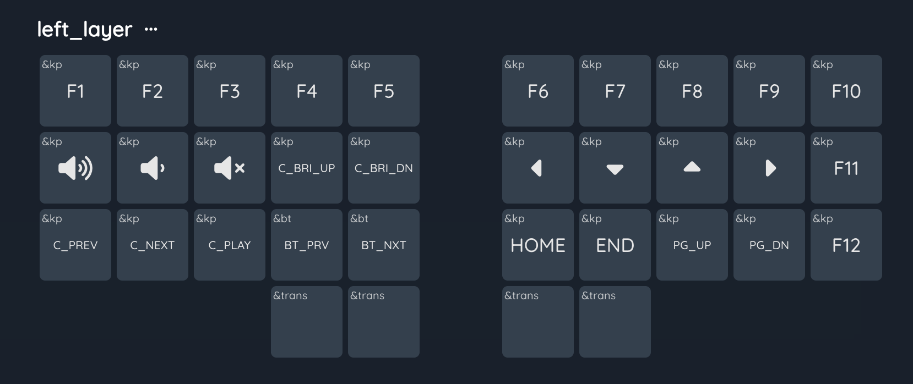
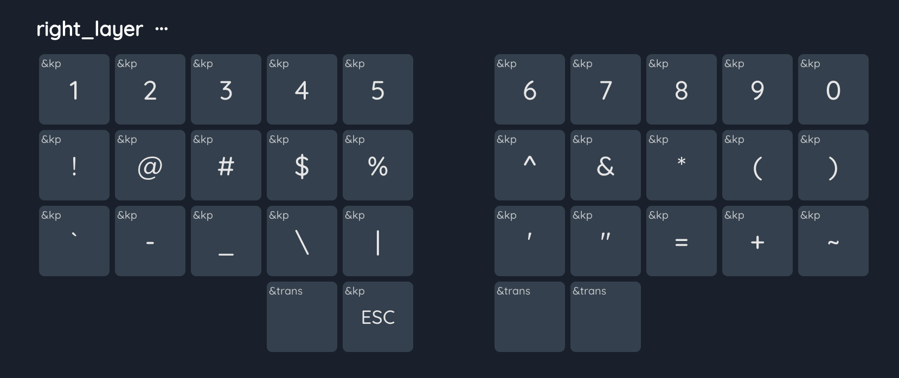
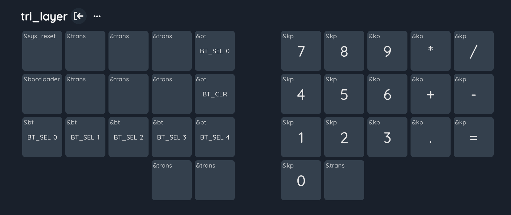
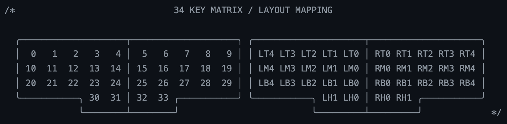

# zmk-config

## My Keymap Layout

Layer 0 --- Default Layer

Layer 1 (left layer) --- Function & Navigation

Layer 2 (right layer) --- Numbers & Symbols

Layer 3 (tri layer) --- Number Pad, Bluetooth & Mouse

Mouse emulations have been added to Layer 3 (the above figure is not updated),
check [Corne Config](https://github.com/yshenfab/zmk-corne) for more info.

## Macros & Combos

ZMK use key positions for combos, the 34 key matirx is defined as

